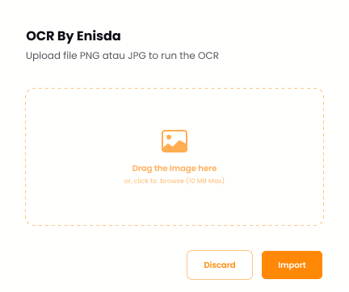

# OCR
A simple optical character recognition (OCR) application using Flask.

## Preview


## Features
- Upload an image containing text
- The application will extract the text from the image
- Result can be copied to the clipboard

## Requirements
- Flask
- Pillow (for image processing)
- tesseract-ocr (for OCR)

## Installation
1. Clone the repository ```git clone https://github.com/learning-enisda/simple-python-ocr.git```
2. Install the requirements ```$ pip install -r requirements.txt```
3. Set the environment variable for tesseract ```$ export TESSDATA_PREFIX=[path_to_tesseract_folder]/tessdata```
4. Run the application ```$ python app.py```
5. Open your browser and go to ```http://localhost:5000``` to use the OCR application

## Usage
1. Choose an image by clicking img icon or drag the image file
2. Click Import
3. The application will extract the text from the image and display it on the page
4. Click the "Copy" button to copy the result to the clipboard

## Contributing
1. Fork the repository
2. Create your feature branch (git checkout -b feature/fooBar)
3. Commit your changes (git commit -am 'Add some fooBar')
4. Push to the branch (git push origin feature/fooBar)
5. Create a new Pull Request

##License

